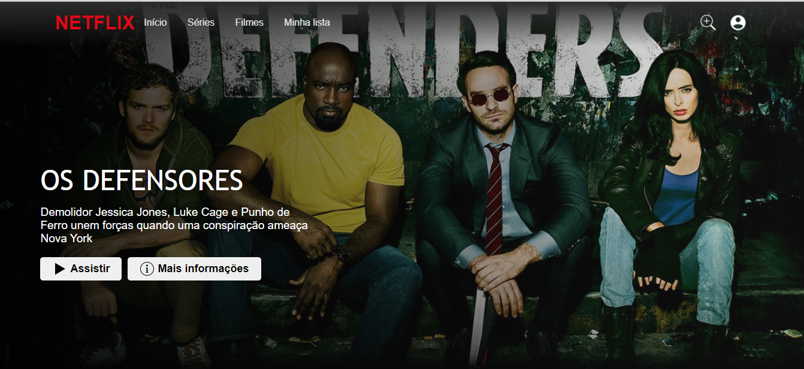

# Netflix-clone
Um clone da Netflix com Html, Css, JS e um pouco de jQuery. O meu primeiro projeto usando jQuery

https://user-images.githubusercontent.com/85517774/160204008-e4e38e32-aab7-4540-a052-16e28e512938.mp4

